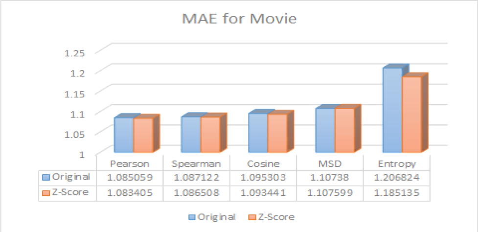
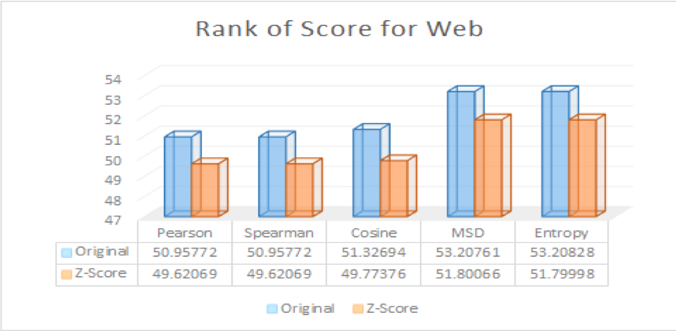
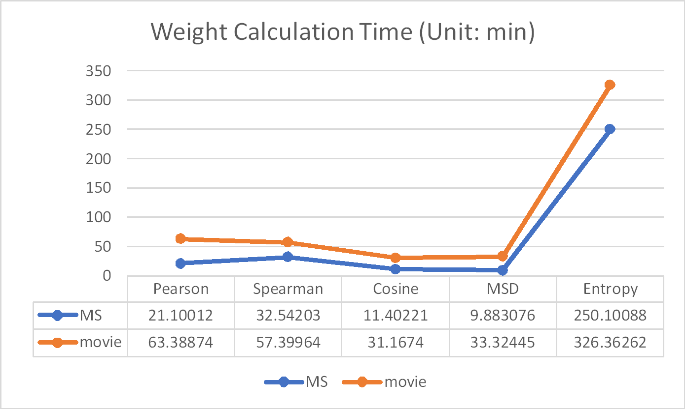
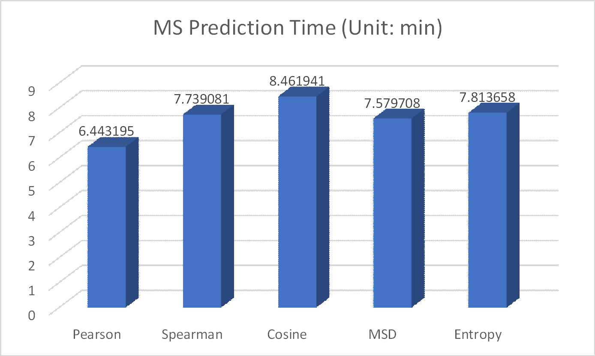
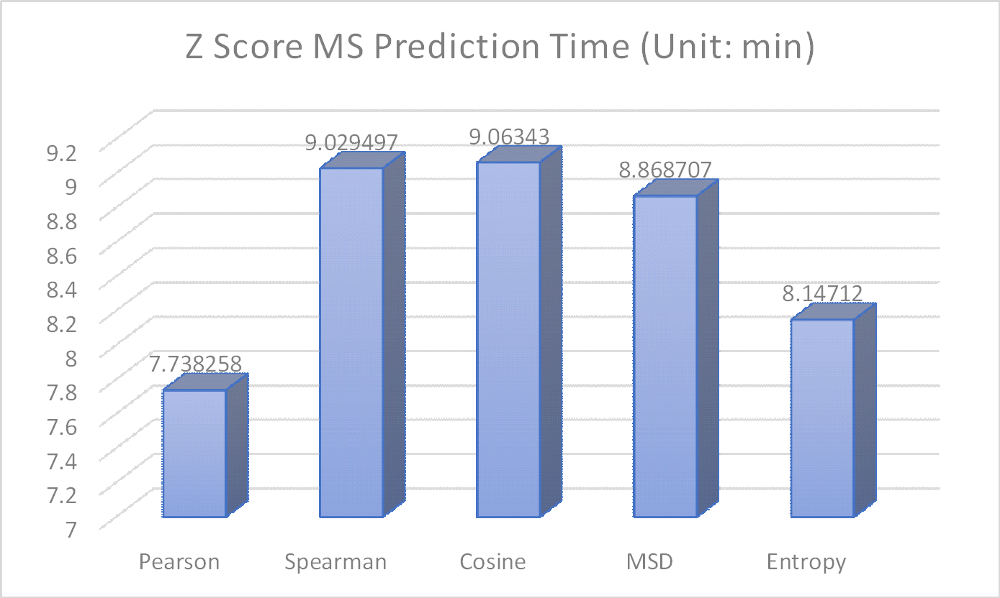
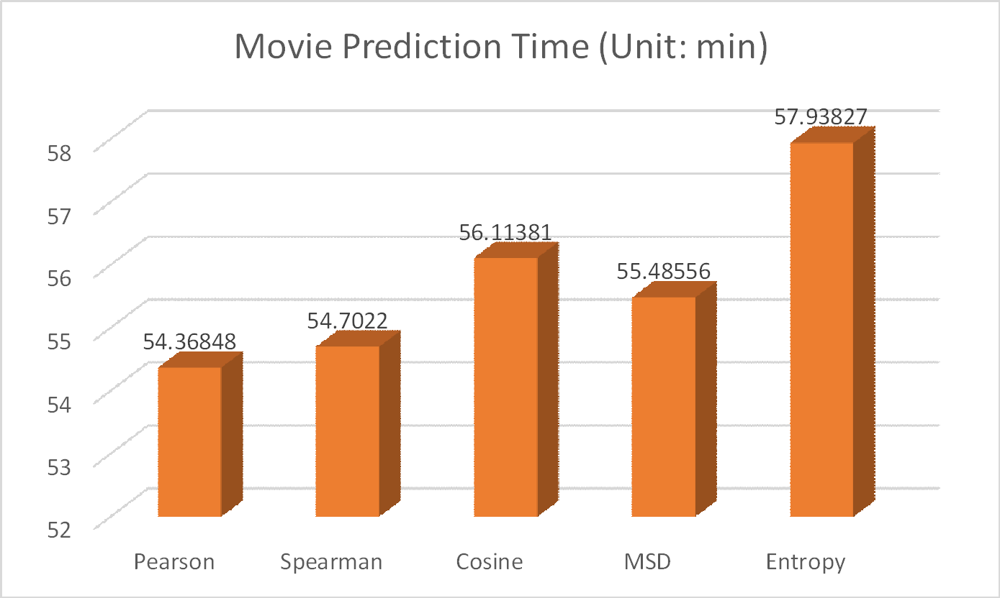
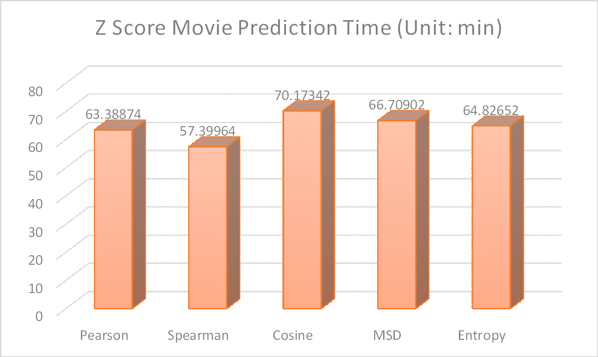
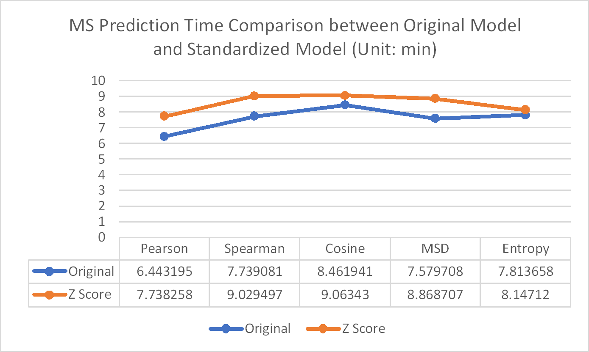
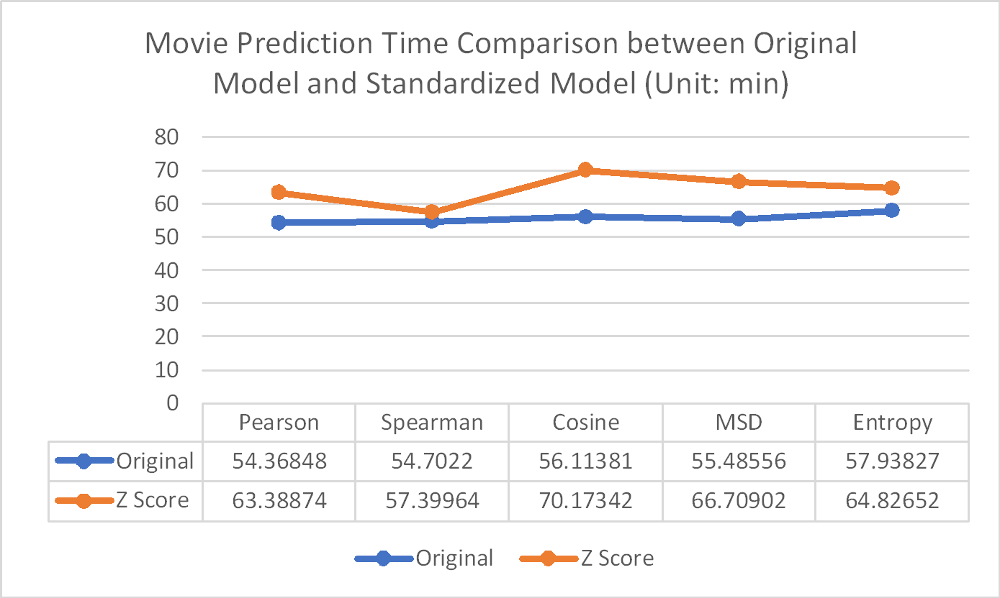

# Spring2018

# Project 3: Algorithm Implementation and Evaluation

----

### [Project Description](./doc/project3_desc.md)

Term: Spring 2018

+ Project title: Algorithms
+ Team Number: 6
+ Team Members: David Arredondo, Sophie Beiers, Huijun Cui,	Richard Shin, Shan Zhong
+ Project summary: We used memory based and model based collaborative filtering to make predictions on a user's rating of an item.

Contribution statement: All team members contributed equally in all stages of this project. All team members approve our work presented in this GitHub repository including this contributions statement. David Arredondo wrote the EM algorithm, and made the slide explaining it. Sophie Beiers wrote the prediction algorithm for the EM algorithm, ran data transformations, organized the main.Rmd and GitHub, and made presentation. Richard Shin wrote the similarity weight function in functions.R and helped write the prediction algorithm for EM step. Huijun and Shan worked on the memory-based model, built up functions, train the original model and Z-Score on MS and movie data sets with Pearson, Spearman, Cosine, Mean-squared Difference, and Entropy correlation, and did prediction for MS and movie test data sets. 

# Collaborative Filtering

### Introduction

Many online sites rely on recommendation systems to better target their user with ads, information or products that their user may enjoy. Collaborative filtering is one such way to better recommend items to a particular user; by searching for other users who have similar interests, algorithms are able to make more accurate suggestions and recommendations.

For this project, we utilized memory-based and model-based algorithms to generate predictions for two datasets: Microsoft Web Data and EachMovie data.

### Memory Based Approach

The memory-based model considered Spearman's correlation, Pearson's correlation, entropy, mean-squared-difference, and rating normalization as weights.

Results below:

Algorithm Efficiency Analysis(Running time):

### Model Based Approach

We utilized the EM algorithm to fuel a Bayesian clustering model. We got the algorithm running fine, but our predictions took far longer than reasonable.
